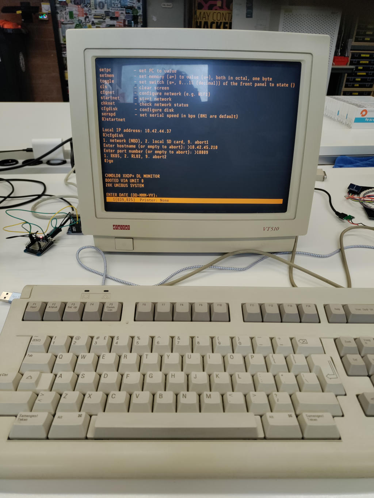
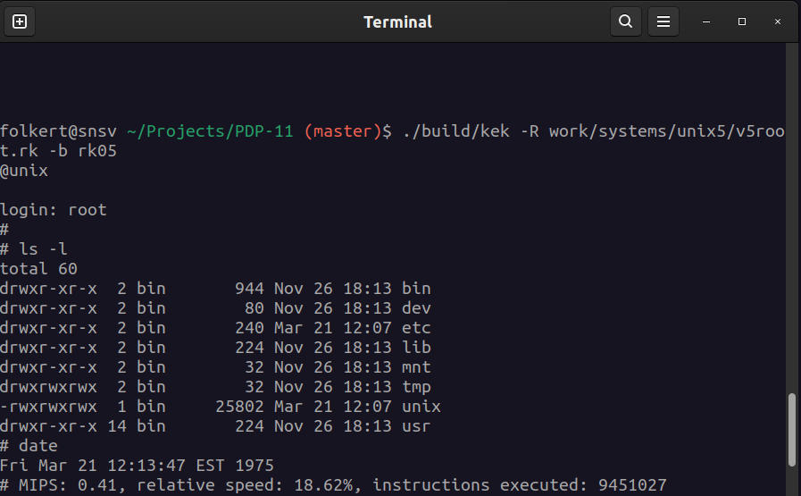

KEK
---
Kek is a DEC PDP-11 (11/70) emulator capable of running UNIX-v6.

To build for e.g. linux:

    mkdir build
    cd build
    cmake ..
    make

    Required:
    * libncursesw5-dev

To build for e.g. windows:

    mkdir build-win32
    cd build-win32
    cmake -DCMAKE_TOOLCHAIN_FILE=../mingw64.cmake ..
    make

To run a disk image:

    ./kek -R filename.rk -b 2> /dev/null

Kek emulates an RK05.

To run a tape image:

    ./kek -T filename.bin -b 2> /dev/null

ESP32
-----
The ESP32 version needs platformio to be build.

    cd ESP32
    pio run -t upload

That should build & upload it to a connected ESP32.

Wiring of SDCARD (or use disk-images exported via NBD over wifi using nbdkit (because of older NBD protocol implementation)):
* MISO: 19
* MOSI: 23
* SCK : 18
* SS  : 5
* and of course connect VCC/GND of the SD-card

Wiring of the MAX232 connection:
* TX  : 17
* RX  : 16

Raspberry PI PICO / RP2040
--------------------------
Wiring of SDCARD:
* MISO: 16
* MOSI: 19
* SCK : 18
* SS  : 17
* and of course connect VCC/GND of the SD-card

The RP2040 version needs platformio to be build.

    cd RP2040
    pio run

Then copy RP2040/.pio/build/BUILD\_FOR\_RP2040/firmware.uf2 to the PICO.

SHA2017-badge
-------------
This procedure will remove the default micropython environment.
Maybe you can undo that, but I have not tried that.

* esptool.py erase\_flash

* pio run -e SHA2017-badge

* esptool.py --chip esp32 --port /dev/ttyUSB0 --baud 921600 --before default\_reset --after hard\_reset write\_flash -z --flash\_mode dio --flash\_freq 80m --flash\_size detect 0x1000 ./.pio/build/ESP32-wemos/bootloader.bin

* pio run -e SHA2017-badge -t upload

After this, you can connect a serial terminal to /dev/ttyUSB0 at 115k2 bps.

pictures
--------

Click on the following picture to see it running (opens a youtube link):

Released under MIT license.

Folkert van Heusden
